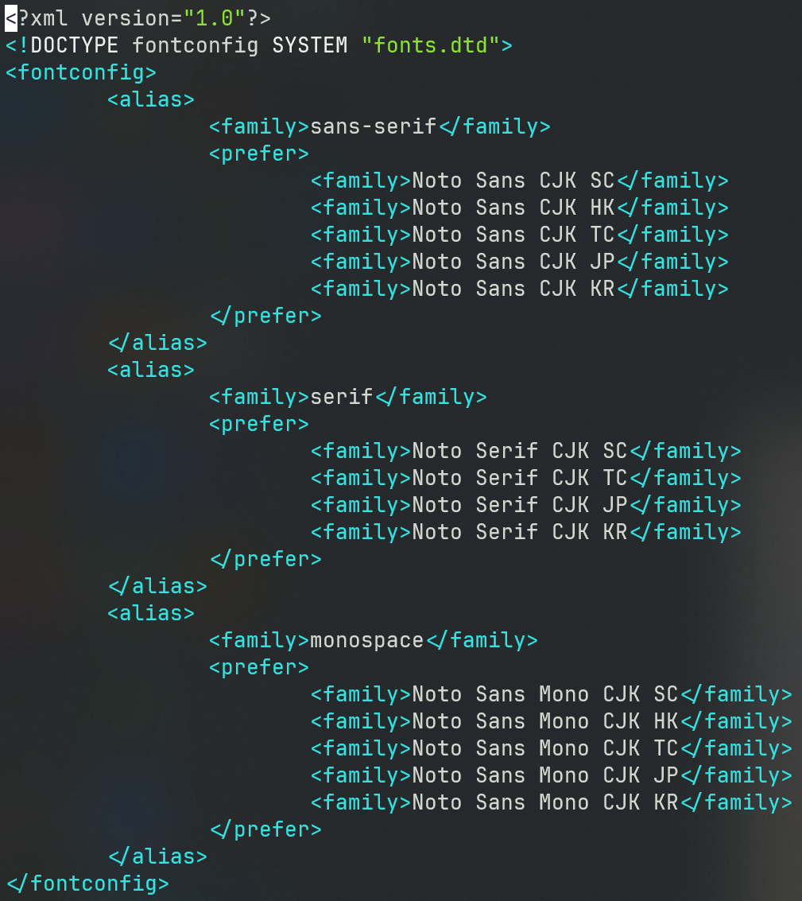

# fishDotFiles

To save my own config files. Work in Ubuntu22 well~ Clone it to:

```
cd ~ && \
git clone https://github.com/sharkocha/fishDotFiles.git
```

Make some soft links to these files when sitting in a new room.

## Usage tools (Dependencies and Installation)

- JetBrainsMono Nerd Font: a good font with glyphs for coding and terminal.
    - Download it [here](https://www.nerdfonts.com/font-downloads).
    - Install font manager for Ubuntu: `sudo apt install font-manager`.
    - Install font in font manager.
- `kitty`: GPU friendly terminal emulator.
    - make soft link for config: `ln -s ~/fishDotFiles/kitty/ ~/.config/kitty`.
- `alacritty`: Another GPU friendly terminal emulator.
    - make soft link for config: `ln -s ~/fishDotFiles/alacritty/ ~/.config/alacritty`.
- `git`
- `build-essentials`
- `golang`(snap for latest)
- `rust`: do not use apt to install but install `rustup` to manage rust version
    - `curl --proto '=https' --tlsv1.2 -sSf https://sh.rustup.rs | sh`
- `miniconda`: virtual env for python, [see this](https://docs.conda.io/projects/miniconda/en/latest/miniconda-install.html).
- `openssh-server`: for SSH serving or connecting
    - use `sudo systemctl start ssh`(enable) to start serving, edit `/etc/ssh/sshd_config` and reboot for SSH serving port changing.
- `htop` : better top.
- `nload`: for network rate monitoring, use `sudo nload -m`.
- `tmux`
    - make soft link for config: `ln -s ~/fishDotFiles/.tmux.conf ~/.tmux.conf`.
- `ranger`:
    - make soft link for config: `ln -s ~/fishDotFiles/ranger/ ~/.config/ranger`.
    - use `ranger --copy-config=all` to get default config files.
- `fzf` for file searching.
- `lazygit`(snap `lazygit-gm`): for operation of git.
- `neovim`(snap)
    - use lazyvim:
    - `git clone https://github.com/LazyVim/starter ~/.config/nvim`
    - `rm -rf ~/.config/nvim/.git`
- `perf`
    - `sudo apt install linux-tools-common`.
    - And follow the command.
- `speedtest-cli`
    - `sudo apt install curl`
    - `curl -s https://packagecloud.io/install/repositories/ookla/speedtest-cli/script.deb.sh | sudo bash`
    - `sudo apt install speedtest`
- `valgrind`
    - `sudo apt install valgrind`
- `docker`
    - `sudo snap install docker`
- `dotnet`
    - `sudo snap install dotnet-sdk --classic`
- `yazi`
    - build from source: https://github.com/sxyazi/yazi.git
    - make soft link for config: `ln -s ~/fishDotFiles/yazi/ ~/.config/`.
    - add conf from bashrc
- `slides`
    - `sudo snap install slides`
    - present markdown in slides in terminal.
- `mdp`
    - `sudo apt install mdp`
    - present markdown in slides in terminal(just for linux).
- `glow`
    - `sudo snap install glow`
    - render markdown in terminal
- `termshark`
    - `sudo apt install termshark`
    - wireshark in terminal
- `nexttrace`
    - `git clone https://github.com/nxtrace/NTrace-core.git`
    - user-friend tracerouter
- `doggo`
    - `git clone https://github.com/mr-karan/doggo.git`
    - user-friend dns client
- `nali`
    - `git clone https://github.com/zu1k/nali.git`
    - user-friend IP query tool
- `typora`
    - `sudo snap install typora`
    - elegent markdown editor
- `WPS`
    - download deb file and install with apt.
- `WeChat`
    - download deb file and install with apt.
- `QQ`
    - download deb file and install with apt.
- Copy some useful config from bashrc file.

## Font Settings

### Install new fonts

Copy `.ttf` file to `/usr/share/fonts/` or its subdirectories and do:

```
cd /usr/share/fonts/
mkfontscale
mkfontdir
fc-cache
```

If you don't have those commands:

```
sudo apt-get -y install fontconfig xfonts-utils
```

NOTE: we can copy fonts from `C:\Windows\Fonts` of a Windows host.

### Weired Chinese fonts

Open file:

```
sudo vim /etc/fonts/conf.d/64-language-selector-cjk-prefer.conf
```

And adjust SC font to top of the list:



Then update the font cache:

```
fc-cache -fv
```

Check if we can get "Noto Sans CJK SC" "Regular"

```
fc-match -s | grep 'Noto Sans CJK'
```

Reboot.

